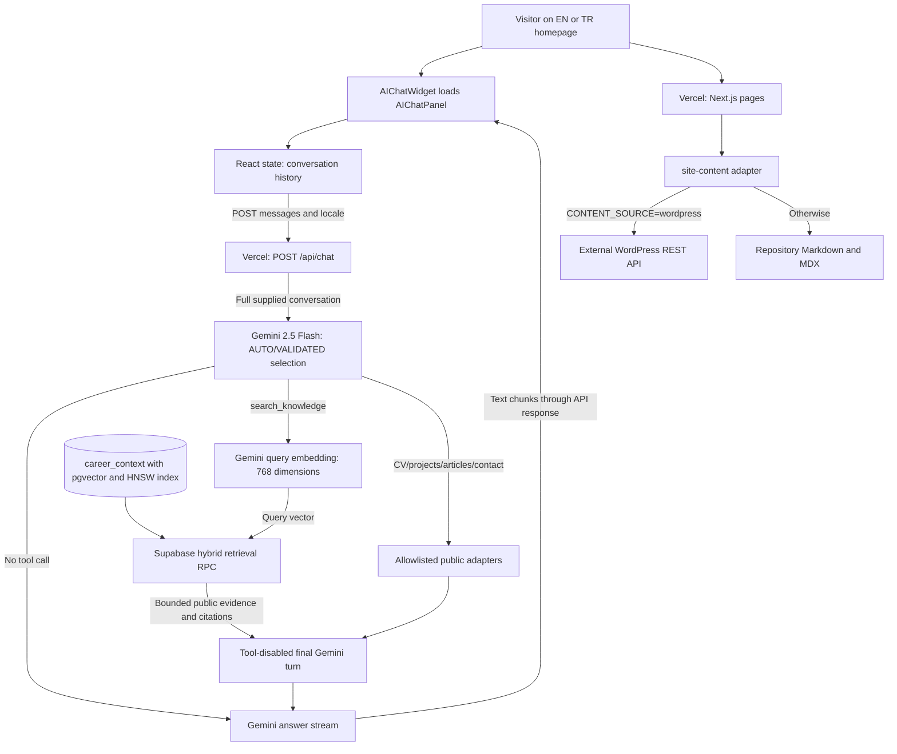
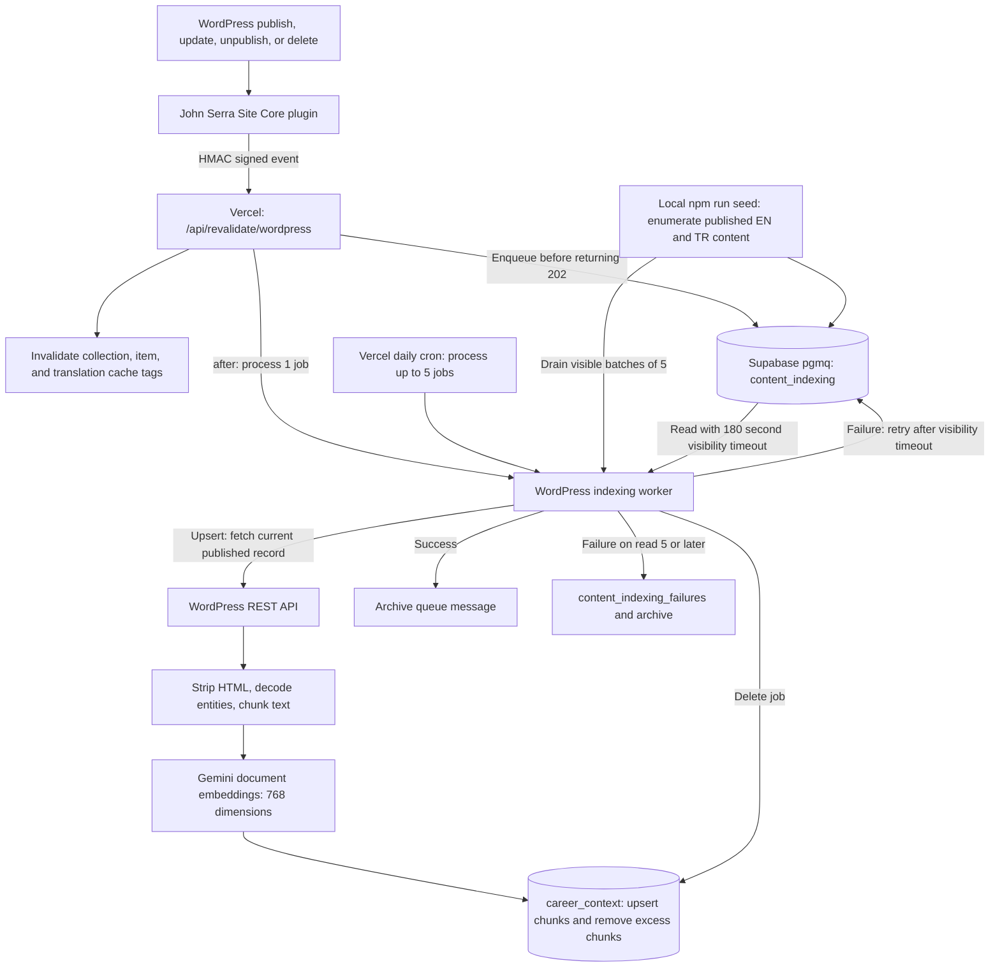

# Digital Twin architecture and challenge baseline

Source baseline: **2026-09-09**, repository commit **4147fda**, prepared for [#17](https://github.com/johnserra/johnserra/issues/17). This is a review of the checked-in implementation, not a production test or a measured quality report. [#10](https://github.com/johnserra/johnserra/issues/10) will establish the repeatable evaluation harness and dated results before retrieval changes.

Subsequent note, **2026-09-10 UTC**: the [#10 assistant evaluation harness](../evals/assistant/README.md) now provides a professional-only case corpus, public evidence manifest, shared chat runner, offline tests, and a [dated live report](../evals/assistant/reports/baseline-2026-09-10T02-27-41-980Z.md). All 34 cases were attempted; 33 completed and one query-embedding quota error leaves the report marked incomplete. Recipe posts were removed on 2026-08-23; John reaffirmed the broader exclusion of cooking on 2026-09-09. At the time of this saved September 10 baseline, the production prompt and a Turkish About record still referred to cooking because stale persona/About text was not all removed in August. The current production prompt no longer contains that stale persona wording; the Turkish About content mismatch may remain. Captured baseline answers confirm this known scope mismatch.

Subsequent update, **2026-09-11 UTC**: [#15](https://github.com/johnserra/johnserra/issues/15) adds a conversational hybrid retrieval pipeline. The chat path now rewrites context-dependent follow-ups into standalone queries using a bounded Gemini call, retrieves a wider candidate set using semantic + lexical (full-text) branches with locale and filter preservation, reranks candidates to ≤6 using reciprocal rank fusion with query-term coverage and source diversity, and preserves the original conversation for generation. The hybrid SQL RPC (`match_career_context_hybrid`) is additive and service-role only; when absent, the original `match_career_context_filtered` path is preserved as a fallback. A versioned EN/TR retrieval corpus and deterministic evaluator report expected-source recall and a clearly labeled context-precision proxy. See [docs/conversational-retrieval.md](conversational-retrieval.md) for the current architecture. The September 9 baseline text below is retained as history.

The Digital Twin is John Serra's personal-site assistant. It combines a third-person, evidence-only persona prompt, browser-managed conversation history, Gemini model-selected access to five bounded read-only tools, public citations, and streamed generation. The [persona, privacy, and prompt-injection guardrails](persona-privacy-guardrails.md) are the canonical policy for this boundary. A selection may request complementary tools in one bounded batch; greetings can still be answered without retrieval.

## Request and deployment architecture

Vercel hosts the Next.js frontend and route handlers; WordPress is hosted independently; Supabase hosts PostgreSQL, vectors, and the indexing queue; Google's Gemini API supplies embeddings and answer generation. WordPress content is read by server code. Browser chat calls the site's own API, with provider and service-role credentials kept out of the client. Resend, contact storage, optional Jetpack CRM, and optional Google Analytics support other site features; they are outside the assistant's retrieval path.

The production frontend domain and `main` auto-deploy behavior are recorded in repository deployment notes. The exact live CMS configuration, active deployment, migration state, index coverage, and provider availability are not asserted by this source review. See the [README](../README.md) for environment setup and deployment workflow.

### One chat turn

1. The [widget](../src/components/widgets/AIChatWidget.tsx) dynamically imports the [panel](../src/components/widgets/AIChatPanel.tsx) after first opening. The panel starts with a localized welcome message.
2. On submission, the panel appends a user message and an empty assistant placeholder to React state. It sends previous messages plus the new user message to `/api/chat`, excluding the welcome message and the new placeholder.
3. The [route](../src/app/api/chat/route.ts) validates the complete request, keeps the Node runtime, and sends the supplied history plus locale-aware system instructions to Gemini with the five declarations. SDK automatic function execution is disabled.
4. Gemini may answer directly, in which case zero tools execute, or return a bounded set of function calls. The application validates the complete batch before dispatching, rejects more than five requested calls, and canonicalizes equivalent validated calls independently of provider ID or object-key order.
5. `search_knowledge` invokes the existing hybrid retrieval layer. The other tools use the reviewed CV or public site-content/contact adapters. Results are projected to public evidence, descriptive titles, and locale-correct canonical URLs; internal IDs, scores, private CV source data, and writes are excluded. Handler failures degrade to typed unavailable evidence while successful siblings remain usable.
6. Accepted tool results are returned with the model function-call parts and matching IDs in one function-response message. A single final Gemini turn runs with tools disabled. Any final follow-on call fails closed; if every selected tool fails, no evidence-free final turn is attempted.
7. `gemini-2.5-flash` text streams through the existing `application/x-ndjson` response contract. The panel decodes deltas and terminal frames; no provider or tool errors are exposed.

### Conversation state and failure behavior

History exists only in the mounted panel's React state. Closing the panel hides it without unmounting it, so reopening retains the conversation. Reloading or unmounting clears it. There is no local-storage persistence, server session store, or application chat-transcript database in this path. The complete supplied history is sent to Gemini on each turn; query embeddings contain only the last message. These observations do not establish an external provider's retention policy.

Earlier turns can influence model selection and answer generation. A follow-up may select `search_knowledge` with a rewritten query through the existing hybrid retrieval layer, while a greeting can take the direct path. Request, tool, output, rate, and deadline boundaries are documented in [chat API hardening](chat-api-hardening.md). The [bounded multi-tool evaluation](multi-tool-evaluation.md) covers fixture replay and privacy-safe traces. This issue adds bounded tool selection, not an iterative verification agent.

Network/non-OK response errors show a generic localized error in the panel. Errors during Gemini streaming are logged server-side and the stream closes; this can look like a successful partial or empty answer. Existing error text and empty assistant entries are not filtered from subsequent history. These are baseline limitations to address in #14, not guarantees of graceful recovery.

## Knowledge ingestion and indexing

### Source contract and chunking

The [WordPress plugin](../wordpress/wp-content/plugins/johnserra-core/README.md) defines locale metadata and translation relationships. Core posts contain blog entries and recipes, core pages include About and Privacy Policy, and `js_project` records are exposed through `/wp/v2/projects`. The [seeder](../scripts/seed-knowledge-base.ts) enumerates all published posts, pages, and projects for `en` and `tr`, independently of `CONTENT_SOURCE`.

For an upsert, the [worker](../src/lib/knowledge/wordpress-indexer.ts) fetches the current record without cached revalidation, using anonymous `context=view`. It checks publication status and locale. An accessible record that no longer matches causes removal; an HTTP error instead follows the retry/failure path. Explicit delete jobs remove rows by WordPress ID and locale without fetching the record.

HTML-to-text conversion removes scripts, styles, and tags, collapses whitespace, and decodes entities. The title is prepended once. Text is split into approximately **2,400-character chunks**, preferring a nearby word boundary, with **300-character overlap**; chunks of 50 characters or fewer are dropped. This does not preserve heading/section hierarchy or role/project boundaries. It indexes rendered title/body text, not every structured ACF field.

Each chunk calls `gemini-embedding-2` with `RETRIEVAL_DOCUMENT`, the document title, and 768 output dimensions. Chunk embedding calls run concurrently within one document; queue jobs are processed sequentially within a batch. The recorded embedding configuration is `gemini-embedding-2:768:v1`.

Rows use source identity `wordpress/<content_type>/<wordpress_id>/<locale>` and a zero-based `chunk_index`. Stored fields include title, slug, locale, content type, publication status, WordPress modified time, embedding model/dimensions, and vector. JSON metadata includes event ID, title, type, slug, locale, WordPress ID, and embedding configuration. Canonical public URLs, section paths, and source-authority rankings are not stored by this worker.

Upserts target the unique `(source, chunk_index)` key, then a separate delete removes excess old chunks. These operations are not an atomic document replacement. Legacy filesystem rows are retained by default; rows without embeddings or with no matching locale cannot satisfy the current retrieval RPC. The retained full-text index is unused by chat.

### Queue, cache, and recovery semantics

The [webhook](../src/app/api/revalidate/wordpress/route.ts) verifies an HMAC-SHA256 signature over the raw body and validates the job shape. It invalidates localized collection, item, and translation cache tags with the `max` profile, then enqueues the event. Queue failure returns 503; a successful enqueue returns 202 and schedules an `after()` attempt to process one available job. Cache freshness and embedding freshness are separate: page revalidation can happen before new embeddings are ready.

The worker reads jobs with a 180-second visibility timeout. Successful jobs are archived. Failed jobs can be retried once visible; on the fifth or later read, failure is recorded in `content_indexing_failures` and the job is archived. The daily cron handles five jobs per invocation, and the seeder drains currently visible batches of five. The queue is durable in Supabase, but there is no continuous dedicated worker, lease renewal, event-ID deduplication, or stale-event ordering guard. Concurrent invocations can therefore overlap, especially when work exceeds the visibility timeout.

WordPress logs failed webhook deliveries but does not durably retry them. Reseeding can recover missed published updates; it does not discover deleted/unpublished records absent from the published enumeration. Locale changes can also leave old-locale rows unless a corresponding removal is processed. Monitor worker logs and the failure table rather than treating the queue alone as proof that all indexed content is current.

## Baseline limitations and follow-on issues

| Area | Current boundary | Roadmap work |
| --- | --- | --- |
| Evaluation | The [professional-only harness](../evals/assistant/README.md) measures retrieval and answer proxies. The versioned [bounded multi-tool corpus](multi-tool-evaluation.md) measures selection, deduplication, limits, degradation, evidence/citation support, and no-tool controls offline; no live Gemini reliability claim is made here. | [#10](https://github.com/johnserra/johnserra/issues/10), [#16](https://github.com/johnserra/johnserra/issues/16) |
| Professional authority | Published WordPress content and a hard-coded biography supply context; no first-class sanitized CV source or conflict-resolution policy. | [#21](https://github.com/johnserra/johnserra/issues/21), [#8](https://github.com/johnserra/johnserra/issues/8) |
| Retrieval | Hybrid semantic + lexical retrieval with query rewrite, reranking, locale invariants, and bounded fallbacks as of 2026-09-11 ([#15](conversational-retrieval.md)). No live retrieval evaluation or paired baseline measurement has been run yet. | [#15](https://github.com/johnserra/johnserra/issues/15) (implemented; live evaluation pending) |
| Citations | Internal source IDs/scores enter the prompt; public URLs and claim-to-source support are not enforced or verified. Rendered links can be generated incorrectly. | [#12](https://github.com/johnserra/johnserra/issues/12) |
| Public API | Only a nonempty-message check; no robust validation, bounded history/output, rate controls, request deadline, or structured stream errors. | [#14](https://github.com/johnserra/johnserra/issues/14) |
| Persona and privacy | Third-person AI-assistant persona grounded in retrieved public evidence, with explicit untrusted-context, disclosure, action-claim, and retention rules. Deterministic corpus coverage is a proxy and does not prove complete security. | [#20](https://github.com/johnserra/johnserra/issues/20) |
| Operations | Chat emits one privacy-safe completion event per request to Vercel runtime logs, with server correlation, outcome/failure categories, stage timings, retrieval/citation aggregates, normalized provider usage, and partial/complete Gemini text-cost estimates. It does not persist telemetry or provide a quality dashboard; platform log retention remains a deployment concern. | [chat observability runbook](chat-observability.md), [#13](https://github.com/johnserra/johnserra/issues/13) |
| Tools | Five application-owned read-only tools are model-selectable with strict schemas, runtime validation, canonical deduplication, per-tool deadlines, UTF-8 result caps, safe logs, graceful degradation, and one final tool-disabled turn. | [model-callable tools](model-callable-tools.md), [multi-tool evaluation](multi-tool-evaluation.md) |
| Verification agent | One generation stream with no evidence-sufficiency loop, verification pass, revision, or recorded agent stop reason. | [#19](https://github.com/johnserra/johnserra/issues/19) |
| Production evidence | Deployment configuration is documented, but end-to-end production scenarios, rollback demonstration, and public case-study evidence remain to be collected. | [#11](https://github.com/johnserra/johnserra/issues/11) |

The original architecture snapshot made no retrieval accuracy, latency, cost, security pass rate, or production availability claim. The subsequent evaluation report records observed retrieval, timings, automated quality proxies, and failures under its stated limitations; it does not establish security or availability guarantees. Keep model and retrieval settings recorded with future evaluation runs so comparisons have a clear reference point.

## Six-week AI Engineering challenge mapping

The curriculum mapping below follows [#22](https://github.com/johnserra/johnserra/issues/22). Week labels describe the challenge topics; implementation follows the dependency order beneath the table.

| Challenge week | Evidence in the baseline | Remaining work |
| --- | --- | --- |
| 1 — LLM fundamentals | Gemini system instruction, user/model roles, streaming, and client-managed conversation history. | #17 architecture documentation; #10 reproducible evaluation baseline. |
| 2 — AI app and guardrails | Next.js chat UI and public API; basic empty-input check. | #14 request hardening, #20 persona/privacy/injection policy, #13 observability. |
| 3 — Tool calling | Five allowlisted application-owned tools, strict runtime validation, disabled SDK auto-execution, bounded multi-call dispatch, matching function responses, safe logs, and offline evaluation. | #19 bounded evidence gathering and answer verification. |
| 4 — RAG | WordPress ingestion, Gemini embeddings, pgvector retrieval, locale filtering, and durable indexing queue. | #21 CV, #8 structure/authority, #15 conversational hybrid retrieval/reranking, #12 public citations. |
| 5 — Deployment | Vercel frontend/API configuration, cron routes, external WordPress/Supabase/Gemini dependencies. | #11 production verification, deployment/rollback evidence, and public case study. |
| 6 — Agentic AI | No agent loop in the current chat path. | #19 bounded evidence gathering and answer verification. |

Execution order: **#17 → #10 → #21 → #8 → #15 → #12 → #14 → #20 → #13 → #18 → #16 → #19 → #11**. The CareerTalkLab follow-on backlog is deferred until this Digital Twin roadmap is complete.

## Source map

| Concern | Implementation |
| --- | --- |
| Homepage and chat UI | [page.tsx](../src/app/[locale]/page.tsx), [AIChatWidget.tsx](../src/components/widgets/AIChatWidget.tsx), [AIChatPanel.tsx](../src/components/widgets/AIChatPanel.tsx) |
| Retrieval, tool calling, and generation | [chat route](../src/app/api/chat/route.ts), [shared chat core](../src/lib/chat/core.ts), [tool registry](../src/lib/chat/tools.ts), [orchestration](../src/lib/chat/tool-calling.ts), [server dependencies](../src/lib/chat/server.ts), [embedding helpers](../src/lib/knowledge/embeddings.ts), [observability](../src/lib/chat/observability.ts) |
| Assistant evaluation | [harness guide](../evals/assistant/README.md), [cases](../evals/assistant/cases.json), [professional sources](../evals/assistant/sources.json), [multi-tool evaluation](multi-tool-evaluation.md) |
| Database clients and base tables | [supabase.ts](../src/lib/supabase.ts), [base schema](../supabase-schema.sql) |
| Vectors, retrieval RPC, queue, grants | [vector/queue migration](../supabase/migrations/00001_wordpress_vector_queue.sql) |
| Indexing and initial population | [WordPress indexer](../src/lib/knowledge/wordpress-indexer.ts), [seed script](../scripts/seed-knowledge-base.ts) |
| CMS events and preview | [plugin webhook](../wordpress/wp-content/plugins/johnserra-core/includes/class-webhook.php), [revalidation route](../src/app/api/revalidate/wordpress/route.ts), [preview route](../src/app/api/preview/wordpress/route.ts) |
| Content source and locale | [site-content.ts](../src/lib/site-content.ts), [WordPress client](../src/lib/wordpress/client.ts), [WordPress content](../src/lib/wordpress/content.ts), [routing.ts](../src/i18n/routing.ts) |
| Scheduling and builds | [vercel.json](../vercel.json), [indexing cron](../src/app/api/cron/process-content-indexing/route.ts), [keep-alive cron](../src/app/api/cron/keep-alive/route.ts), [CI](../.github/workflows/ci.yml), [package.json](../package.json) |
