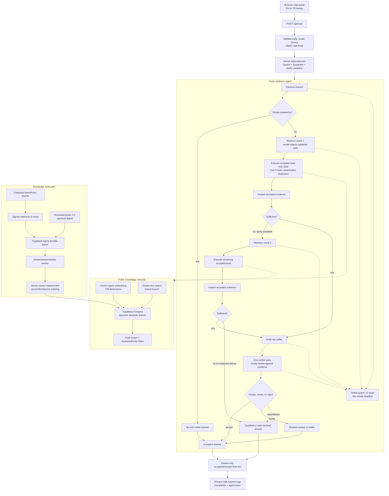

# Digital Twin architecture

This document describes the current implementation at the repository baseline for issue #11. The readable narrative is the [Digital Twin engineering case study](digital-twin-case-study.md); the [operations runbook](digital-twin-operations.md) is the procedural companion. Historical evaluation material remains dated and unchanged.

## Current topology

The public site is a Next.js 16 App Router application on Vercel. `POST /api/chat` receives the browser-held conversation history, validates it, applies rate limits, and invokes the bounded evidence agent with server-owned dependencies. The agent uses Gemini for interpretation, retrieval planning, drafting, and bounded review; it uses Supabase for public knowledge retrieval and WordPress/CV adapters for bounded public records.

The internal selection, inspection, draft, and verifier responses are buffered. They are not streamed to the browser. The final stream can be a direct no-tool answer, an accepted answer, a revised answer, or a qualified/safe failure response.

## Retrieval: semantic plus lexical RAG

Retrieval-augmented generation (RAG) means that the model receives a bounded packet of retrieved source evidence at answer time instead of relying only on its parametric memory. Here, `search_knowledge` is a hybrid public-knowledge retriever:

1. The query is embedded with the configured 768-dimensional Gemini embedding model.
2. Supabase Postgres searches the `pgvector` embedding column for semantic similarity and a GIN full-text index for lexical matches. The lexical configuration is `simple`, chosen so English and Turkish text can be tokenized without depending on language-specific dictionaries.
3. The SQL function fuses the branches, applies publication, visibility, locale, document-type, authority, and optional CV filters, and returns a small evidence set with canonical URLs.
4. The agent inspects the accepted evidence. If it is insufficient, it may formulate one narrower query for a second retrieval round.

The retriever is limited to published public WordPress content and the reviewed public CV. It is not a general web search engine and it does not ingest private conversations. The vector-column and RPC shape follows the [Supabase vector columns guidance](https://supabase.com/docs/guides/ai/vector-columns); the repository-specific hybrid function is in [00004_hybrid_retrieval.sql](../supabase/migrations/00004_hybrid_retrieval.sql).

## Model-selected, read-only tools

The registry exposes exactly five names to the model:

| Tool | Public evidence returned | Write capability |
| --- | --- | --- |
| `search_knowledge` | Hybrid search matches and canonical citations | None |
| `get_cv_timeline` | Reviewed public CV timeline and references | None |
| `get_project_details` | One published project by slug | None |
| `list_articles` | Bounded summaries of published articles | None |
| `get_contact_options` | Existing public contact routes | None; it never submits a message or sends email |

Schemas reject unknown fields and constrain locale, slug, URL, and result sizes. A handler result is accepted only after validation and bounded serialization. Tool failures become typed, safe evidence gaps; an all-failure path does not let the model pretend that evidence exists. Duplicate calls are canonicalized independently of provider call IDs and object-key order.

## Bounded orchestration and verification semantics

The current loop is intentionally agentic but finite:

- at most **3 accepted tool executions** across the run;
- at most **2 retrieval rounds**;
- one evidence inspection after each retrieval round;
- one buffered draft;
- exactly **1 verifier pass** when a draft exists;
- at most **12 state-machine steps**;
- a **45,000 ms model/agent deadline**.

The 45-second value is the agent's model deadline, including its bounded turns. The HTTP stream can end earlier because of client cancellation, provider failure, or an outer platform/transport boundary; an HTTP 200 is not proof of a supported answer. Tool handlers also have shorter per-tool deadlines.

The verifier is a model review of the draft against the accepted evidence packet. It can accept, return a complete revised answer with unsupported claims removed or qualified, or reject the draft. It is not a semantic proof system, fact-checking oracle, or guarantee that a source is true. The fail-closed contract is narrower: every professional, biographical, project, and citation claim in an accepted answer must be grounded in the packet or explicitly qualified.

Agent terminal reasons include `static_completion`, `direct_no_tools`, `supported_evidence`, `qualified_completion`, `insufficient_evidence`, `all_tools_failure`, `verifier_failure`, `inspection_failure`, `deadline_exceeded`, `budget_exceeded`, `provider_failure`, `output_limit`, and `cancellation`. `static_completion` is the deterministic zero-provider path for bounded EN/TR social messages; it is an operational outcome, not a quality score or provider completion.

## WordPress and CV indexing

Published WordPress posts, pages, and projects arrive through a signed webhook or an explicit seed. The webhook enqueues a source job in Supabase `pgmq`; an immediate attempt may process one available job and the scheduled cron processes bounded batches. The worker embeds public content, replaces the source's rows atomically, removes excess stale chunks, and preserves per-source version/tombstone state so older events cannot resurrect deleted content. A full seed covers the current published snapshot; it is not a complete repair for every missed deletion event.

The CV is a separate registered source. A human reviews the structured public artifact, computes its canonical approval digest, and only then runs the approval-bound apply procedure. The worker checks the same digest before embedding. This approval boundary prevents an unreviewed local CV edit from becoming retrievable public knowledge. The CV's authority is distinct from authored posts and project pages.

The numbered database sequence is:

1. [`00001_wordpress_vector_queue.sql`](../supabase/migrations/00001_wordpress_vector_queue.sql) — vector extension, WordPress fields, queue, and base retrieval support.
2. [`00002_cv_knowledge.sql`](../supabase/migrations/00002_cv_knowledge.sql) — reviewed CV fields, strict validation, and filtered retrieval.
3. [`00003_wordpress_structure_aware.sql`](../supabase/migrations/00003_wordpress_structure_aware.sql) — section metadata and version-ordered atomic replacement.
4. [`00004_hybrid_retrieval.sql`](../supabase/migrations/00004_hybrid_retrieval.sql) — additive semantic-plus-lexical retrieval and rank fusion.
5. [`00005_chat_api_hardening.sql`](../supabase/migrations/00005_chat_api_hardening.sql) — private HMAC identity counters for fixed-window chat limits.

Apply them only with the compatible worker and application cutover plan described in the [operations runbook](digital-twin-operations.md). Do not switch a structure-aware worker onto a database that lacks 00003, and do not enqueue CV work before the reviewed source, application code, and 00002 are verified.

## Multilingual behavior and citations

The assistant accepts `en` and `tr` locales. WordPress records are indexed per locale and returned with locale-appropriate canonical URLs. Hybrid retrieval uses shared structural metadata and the `simple` lexical configuration. When Turkish retrieval needs professional-history context, the filtered SQL path can reserve reviewed English CV evidence; that fallback is explicit and bounded, not an instruction to translate arbitrary private material.

Citation objects are produced by the public adapters and constrained to `https://johnserra.com/...`. The draft prompt requires exact canonical URLs from the accepted packet, and the verifier checks that citations remain supported. The UI may render Markdown links; observability records only citation counts and presence, never URLs or answer text.

## Security, privacy, and failure boundaries

The application keeps provider keys, WordPress credentials, and the Supabase service-role key server-side. Tool declarations are an allowlist; arguments and results are schema-validated; output is capped by UTF-8 byte budgets; rate limits use HMAC-SHA-256 digests of session/IP identities; and the private rate-limit table is service-role-only. Read-only tools do not submit contact forms, send mail, mutate WordPress, or write Supabase rows.

Runtime logs contain stable, sanitized event metadata and a correlation UUID. They exclude prompts, conversation history, generated text, retrieved content, URLs, internal IDs, query text, tool arguments, provider error text, secrets, IP addresses, session IDs, and stack traces. See the [chat observability runbook](chat-observability.md) and [persona/privacy guardrails](persona-privacy-guardrails.md).

The optional same-browser chat history is client-only: after explicit visitor opt-in, the widget stores a versioned, bounded set of completed exchanges in that browser's `localStorage` and restores it locally. The browser sends selected history to the existing chat API for a new answer; the server still validates message and byte limits and does not persist transcripts. New, delete-current, and delete-all/turn-off controls are browser-local. See the [approved local persistence decision](chat-local-persistence-decision.md).

## Known limitations

- The model verifier is bounded review, not semantic proof; source correctness and answer usefulness still need human evaluation.
- The checked-in agent evaluator computes metadata from deterministic fixture replay. It does not call live providers and is not runtime state-machine testing; actual node tests and live traces are separate evidence.
- The paired retrieval corpus still misses three WordPress expected sources after the structure-aware improvement; the result is non-regression evidence, not perfect retrieval.
- Generated-answer quality, multi-session concurrency, current live trace capture, screenshot evidence, and the requested approximately two-minute demonstration are separate evidence items. Their status is recorded as pending in the [case study](digital-twin-case-study.md); no success is inferred from source or deployment metadata.
- Vercel runtime logs are operational evidence, not a durable transcript or trace store; retention is governed by the platform. The `CONTENT_SOURCE=wordpress` page adapter and filesystem fallback are separate from chat retrieval.

## Historical baseline and source map

The September 10 assistant baseline is preserved in [`evals/assistant/reports/baseline-2026-09-10T02-27-41-980Z.md`](../evals/assistant/reports/baseline-2026-09-10T02-27-41-980Z.md). It attempted 34 cases, completed 33, and stopped on one embedding quota error. It describes an earlier evaluation path and is not a current bounded-agent benchmark. The September 11 retrieval comparison is preserved in [`evals/chunking/comparison-2026-09-11.md`](../evals/chunking/comparison-2026-09-11.md); its figures and scope are summarized in the [case study](digital-twin-case-study.md).

Implementation references:

- [Production chat route](../src/app/api/chat/route.ts)
- [Bounded agent loop](../src/lib/chat/agent-loop.ts)
- [Agent and chat limits](../src/lib/chat/limits.ts)
- [Tool registry and dispatch](../src/lib/chat/tools.ts)
- [WordPress knowledge operations](wordpress-knowledge.md)
- [Reviewed CV knowledge operations](cv-knowledge.md)
- [Bounded evidence-agent design](bounded-evidence-agent.md)
