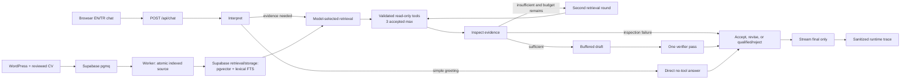

# Digital Twin engineering case study

**Verification dates:** 2026-09-13–14 UTC
**Repository:** `johnserra`  
This is a repository-published technical case study. It does not add an application route, an MDX project, or a WordPress record. That boundary matters because the live site can select `CONTENT_SOURCE=wordpress`; this document is independently reviewable in the repository and is not evidence that a CMS page has been published.

## Outcome in one paragraph

The Digital Twin is a bilingual Next.js assistant that answers from John's published public work and a reviewed public CV. Its current chat path is a bounded evidence agent: Gemini interprets the request, selects validated read-only tools, inspects accepted evidence, drafts into a buffer, and runs one model verifier before streaming an accepted or qualified answer. Public knowledge retrieval is hybrid RAG: semantic `pgvector` similarity and lexical full-text search are fused in Supabase Postgres. WordPress publishing feeds a durable `pgmq` indexing queue; CV indexing has a separate human approval digest. The design favors small, inspectable boundaries over an open-ended agent loop.

## Verified deployment state

The production build was staged with production configuration, passed CI and a homepage readiness check, then promoted on 2026-09-13. The [dated deployment record](../evals/production/2026-09-13-after/deployment.json) identifies the version used for capture:

| Field | Value |
| --- | --- |
| Production URL | [johnserra.com](https://johnserra.com) |
| Deployment | `dpl_DLTw265AKUjT2ESHPBHHzhDVS36a` |
| Target/state | `production` / `READY` |
| Runtime commit | `fd35295159579b8845b7ed15a0e656db43b795f1` |

The initial runtime commit `e37251031c360215f4f429f7491458f8038fd445`, deployment, and failed baseline remain in the [before evidence](../evals/production/2026-09-13-before/). Deployment readiness alone does not prove answer quality; the response and runtime evidence below provide that separate check.

## Architecture and control flow

The current flow is documented in the [architecture reference](digital-twin-architecture.md) and implemented by the [chat route](../src/app/api/chat/route.ts) and [bounded agent loop](../src/lib/chat/agent-loop.ts).

The envelope is deliberately explicit: three accepted tool executions, two retrieval rounds, one verifier, twelve state steps, and a 45-second model deadline. Internal model text is buffered. The verifier is a model review against accepted evidence, not semantic proof. If evidence is insufficient or a bounded dependency fails, the answer is qualified or safely declined instead of being presented as confirmed.

## RAG and tool boundaries

RAG supplies a bounded public evidence packet to the model at answer time. `search_knowledge` embeds the query, searches the 768-dimensional vector column and a GIN full-text branch, fuses the rankings, applies public/locale/authority filters, and returns canonical citations. The lexical branch matters for exact names, titles, and terms; the semantic branch helps with paraphrases. The [hybrid migration](../supabase/migrations/00004_hybrid_retrieval.sql) and [WordPress knowledge guide](wordpress-knowledge.md) define the repository-specific behavior. Supabase's general vector-column/RPC model is documented in its [primary guidance](https://supabase.com/docs/guides/ai/vector-columns).

The model can see exactly these five server-owned names:

| Tool | Purpose | Write boundary |
| --- | --- | --- |
| `search_knowledge` | Hybrid search over published public knowledge | Read-only |
| `get_cv_timeline` | Reviewed public CV timeline | Read-only |
| `get_project_details` | One public project by slug | Read-only |
| `list_articles` | Bounded public article summaries | Read-only |
| `get_contact_options` | Existing ways to contact John | Read-only; never sends or submits |

Tool declarations, arguments, and outputs are schema-validated. Calls are canonicalized to prevent duplicate work. A handler timeout or malformed result becomes a typed safe failure. The agent does not expose database rows, private WordPress drafts, prompts, or provider diagnostics to the user.

## WordPress pipeline and reviewed CV boundary

The publishing path is:

1. A published WordPress EN/TR post, page, or project is observed by a signed webhook or a controlled seed.
2. The source identity and locale are placed on a durable Supabase `pgmq` queue.
3. An immediate attempt or scheduled worker reads bounded jobs, fetches public content, embeds it, and performs atomic source replacement.
4. Version/tombstone state prevents stale in-flight events from resurrecting content; old chunks for the source are removed when the replacement succeeds.
5. The indexed public source becomes available to hybrid retrieval.

The reviewed CV is not an informal second WordPress page. A human reviews the structured public artifact, approves its canonical digest, and the apply procedure enqueues an approval-bound job. The worker verifies the same digest before embedding. This creates a clear approval boundary between local editing and public retrieval. See [CV operations](cv-knowledge.md) and [WordPress operations](wordpress-knowledge.md).

The migration order is verified from the repository as:

1. [`00001_wordpress_vector_queue.sql`](../supabase/migrations/00001_wordpress_vector_queue.sql)
2. [`00002_cv_knowledge.sql`](../supabase/migrations/00002_cv_knowledge.sql)
3. [`00003_wordpress_structure_aware.sql`](../supabase/migrations/00003_wordpress_structure_aware.sql)
4. [`00004_hybrid_retrieval.sql`](../supabase/migrations/00004_hybrid_retrieval.sql)
5. [`00005_chat_api_hardening.sql`](../supabase/migrations/00005_chat_api_hardening.sql)

Setup, cutover, inspection, and rollback are procedures in [digital-twin-operations.md](digital-twin-operations.md). This release changes the agent runtime and documentation; it adds no database migration or indexing mutation.

## Multilingual handling and citations

The application accepts English and Turkish locale values. WordPress knowledge is indexed with locale and canonical URL metadata. The `simple` lexical configuration gives the two locales a shared tokenization baseline without relying on a missing language-specific dictionary. A Turkish professional-history lookup may use explicitly filtered reviewed English CV evidence where the source policy allows it; it does not search private data or silently broaden authority.

Answers cite canonical `https://johnserra.com/...` URLs from accepted public evidence. The drafter and verifier receive an explicit URL allowlist derived only from accepted tool citations. A link merely mentioned inside source text does not become an authorized citation. A deterministic final check rejects any answer with URLs outside that allowlist; the model verifier separately reviews support. Citation presence and count are observable; citation URLs and answer text are not logged.

## Why pgvector and Vercel here

The choice was architectural, not a benchmark claim. Existing knowledge already lives in Postgres/Supabase, and the Next.js application already runs on Vercel. Keeping embeddings, relational metadata, locale/authority filters, queue state, and RPC boundaries together in Postgres reduces the number of operational boundaries the small system must coordinate. Vercel keeps the existing frontend/API deployment shape and its runtime logging and environment model.

That does not make the alternatives unsuitable. Chroma supports client-server and Cloud deployment options, and Hugging Face Spaces is a capable host for machine-learning demos and applications. The relevant primary references are [Chroma deployment](https://docs.trychroma.com/deployment) and [Hugging Face Spaces overview](https://huggingface.co/docs/hub/spaces-overview). This case study makes no comparative latency, cost, recall, or production-readiness benchmark claim for those platforms.

## Security and privacy controls

- Provider keys, WordPress credentials, and the Supabase service-role key stay server-side.
- The model receives an allowlisted tool registry; argument schemas reject extra fields and constrain locale, slug, URL, and size.
- Tool and final-output budgets are capped by UTF-8 bytes. Rate limits use HMAC-SHA-256 identity digests; raw session/IP values are not stored in the rate-limit table.
- Read-only tools cannot submit contact messages, send mail, mutate WordPress, or write database rows.
- Runtime events retain a correlation UUID and bounded counts only. They exclude prompts, answers, source content, URLs, internal IDs, arguments, provider errors, secrets, IPs, session IDs, and stack traces.
- The verifier can remove or qualify unsupported claims, but it cannot grant truth to an untrusted source.

The canonical policy is [persona, privacy, and prompt-injection guardrails](persona-privacy-guardrails.md); the event and incident procedure is [chat observability](chat-observability.md).

## Evaluation methodology and measured results

### Historical assistant baseline — 2026-09-10

The preserved [baseline report](../evals/assistant/reports/baseline-2026-09-10T02-27-41-980Z.md) attempted **34** cases, completed **33**, and recorded **one embedding quota error**. This is a historical, incomplete provider run. It evaluated the then-current assistant harness and is not a current bounded-agent quality benchmark. Its automated answer and citation measures are proxies that require human semantic review.

### Paired chunking/retrieval comparison — 2026-09-11

The checked-in [paired comparison](../evals/chunking/comparison-2026-09-11.md) used 39 cases: the 27 assistant cases with expected sources plus 12 CV cases. It shared each query embedding between a historical old index and a structure-aware candidate index, used the filtered retrieval RPC with threshold 0.65 and limit 6, made no generation calls, and performed zero production writes. The current hosted index reproduces the candidate structure.

| Measure | Historical old index | Structure-aware candidate |
| --- | ---: | ---: |
| Cases retrieving an expected source | 32/39 | 36/39 |
| Expected sources retrieved | 33/42 | 37/42 |
| WordPress chunks | 69 | 182 |
| Retained legacy filesystem chunks | 139 | 139 |
| CV chunks | 18 | 18 |

There were no lost expected sources; four WordPress cases gained a source hit and three WordPress cases still missed their expected source. The hosted rollout later reproduced 36/39 case hits and 37/42 expected-source hits. This demonstrates retrieval non-regression on a fixed corpus, not perfect retrieval and not generated-answer grounding. The original baseline reports remain unchanged.

## What production verification changed

The initial six-case run exposed failures that the offline fixtures had not caught. Successful CV retrieval was followed by an empty structured inspector response, and a later local reproduction exposed verifier output truncation. The release removes the incompatible no-tools configuration, disables thinking for the bounded JSON/draft calls, and reserves enough output for the verifier: 512 draft tokens and 640 verifier tokens within the existing 4,096-token reservation envelope. Cumulative provider usage snapshots are counted once per internal turn, including failure paths. A narrow capability-greeting path and English/Turkish safe fallbacks complete the runtime changes.

A further Turkish reproduction exposed a source-authority problem: a project URL embedded in CV content was treated as if the project page had been retrieved. The explicit citation allowlist and source-boundary instructions clarify that distinction while preserving the final rejection guard. They do not guarantee model compliance: the subsequent combined CV/project Turkish request still ended in `verifier_failure`, while the English comparison completed with two tools and one verification pass. Both exact outcomes are retained in [predeployment live results](../evals/production/2026-09-13-after/predeployment-live-results.json).

The final local assistant suite passed **173 tests**, including rejection of an unapproved URL embedded in a CV, provider configuration, token accounting, and bounded failure behavior. Lint and TypeScript passed. The [CI run for the captured runtime commit](https://github.com/johnserra/johnserra/actions/runs/34787050732) also passed the repository's CV, SQL, hybrid retrieval, rate-limit, assistant, retrieval-validation, and build checks. These deterministic checks establish runtime contracts; they do not establish general answer accuracy.

## Demonstration

[Watch the two-minute production walkthrough](../public/digital-twin/demo-2026-09-14.webm), captured on 2026-09-14 UTC. The selected greeting, explicit CareerTalkLab/CV comparison, and Turkish project question all completed. The English comparison used two tools and one verifier; the Turkish answer used one tool and one verifier. Citation destinations returned HTTP 200. The [evidence README](../evals/production/2026-09-13-after/README.md) includes cited response images, the exact transcript, server traces, and the video's English-panel scrolling limitation.

## Live evidence and remaining limitations

The fixed six-scenario API replay on **2026-09-13 UTC** passed **3/6** behavioral checks, compared with **0/6** on the initial production deployment. Exact answers, timestamps, citation checks and correlation IDs are public in [the after evidence](../evals/production/2026-09-13-after/README.md); the [original failures](../evals/production/2026-09-13-before/README.md) remain unchanged.

| Scenario | Initial | After | Actual after trace |
| --- | --- | --- | --- |
| Capability greeting | Fail | Pass | `direct_no_tools` |
| Professional strengths with citations | Fail | Pass | CV + knowledge search; one verifier; `qualified_completion` |
| Ambiguous follow-up | Fail | Fail | `insufficient_evidence`, zero tools |
| Turkish-language professional question | Fail | Fail | `insufficient_evidence`, one tool; request locale was `en` |
| Unsupported Nobel Prize premise | Fail | Fail | Generic qualification; `insufficient_evidence`, one tool |
| Multi-source AI product assessment | Fail | Pass | CV + knowledge search; one verifier; `qualified_completion` |

This is a small diagnostic sample, not a reliability estimate. The same six prompts and harness policy were retained, including its `locale=en` setting and history built from earlier passing answers. Because earlier answers now pass, later requests contain different generated history; this is not a controlled paired comparison of identical payloads. An HTTP 200/done response alone does not pass. The unsupported-premise result was safe but too generic to meet its behavioral criterion.

The two successful factual API answers have independently retrieved production logs showing `get_cv_timeline` and `search_knowledge`, followed by one verifier pass. The [trace example](../evals/production/2026-09-13-after/multi-tool-trace.md) connects one exact public answer to those events. The verifier's supported-claim counts are model judgments, not audited truth labels.

The demo uses selected explicit-source questions and is reported separately from the six-case replay. Earlier recording attempts are disclosed in the evidence README: one failed before sending requests because of an incorrect button selector; a later UI attempt showed a broad English role-fit fallback and a cited Turkish project answer before recording finalization was interrupted. Selecting explicit project/CV questions for a walkthrough does not resolve those broader failures.

Known limitations include ambiguous follow-ups, generic qualification of unsupported premises, combined-source Turkish requests that can still fail verification, and inconsistent requested answer length. The verifier is not semantic proof. The checked-in agent evaluation computes fixture metadata; runtime contracts are covered by the separate assistant tests. Runtime logs are not a durable transcript, the paired retrieval evaluation did not measure generated-answer quality or concurrency, and full seeding does not repair every missed deletion event. Conversations are not persisted across reloads; that future work remains in #27.

## Milestones and follow-ons

These are the roadmap issue/PR mappings relevant to this work:

| Issue | Scope | Pull request |
| --- | --- | --- |
| [#17](https://github.com/johnserra/johnserra/issues/17) | Architecture | — |
| [#10](https://github.com/johnserra/johnserra/issues/10) | Assistant baseline | [PR #24](https://github.com/johnserra/johnserra/pull/24) |
| [#21](https://github.com/johnserra/johnserra/issues/21) | Reviewed CV | [PR #25](https://github.com/johnserra/johnserra/pull/25) |
| [#8](https://github.com/johnserra/johnserra/issues/8) | Structure-aware chunking | [PR #26](https://github.com/johnserra/johnserra/pull/26) |
| [#15](https://github.com/johnserra/johnserra/issues/15) | Retrieval | [PR #28](https://github.com/johnserra/johnserra/pull/28) |
| [#12](https://github.com/johnserra/johnserra/issues/12) | Citations | [PR #29](https://github.com/johnserra/johnserra/pull/29) |
| [#14](https://github.com/johnserra/johnserra/issues/14) | Hardening | [PR #30](https://github.com/johnserra/johnserra/pull/30) |
| [#20](https://github.com/johnserra/johnserra/issues/20) | Guardrails | [PR #31](https://github.com/johnserra/johnserra/pull/31) |
| [#13](https://github.com/johnserra/johnserra/issues/13) | Observability | [PR #32](https://github.com/johnserra/johnserra/pull/32) |
| [#18](https://github.com/johnserra/johnserra/issues/18) | Tools | [PR #33](https://github.com/johnserra/johnserra/pull/33) |
| [#16](https://github.com/johnserra/johnserra/issues/16) | Multi-tool evaluation | [PR #34](https://github.com/johnserra/johnserra/pull/34) |
| [#19](https://github.com/johnserra/johnserra/issues/19) | Bounded evidence agent | [PR #35](https://github.com/johnserra/johnserra/pull/35) |
| [#11](https://github.com/johnserra/johnserra/issues/11) | Production verification and evidence | [PR #36](https://github.com/johnserra/johnserra/pull/36) |
| [#22](https://github.com/johnserra/johnserra/issues/22) | Roadmap parent | — |

[#27](https://github.com/johnserra/johnserra/issues/27) is deferred until roadmap [#22](https://github.com/johnserra/johnserra/issues/22) is complete. Its scope is instant FAQs, persistent conversations, and additional business-development functionality; it is not the live evaluation or evidence-capture issue. Those acceptance gaps remain in #11.

## Related documents

- [Current architecture](digital-twin-architecture.md)
- [Operations runbook](digital-twin-operations.md)
- [Chat observability](chat-observability.md)
- [Bounded evidence-agent design](bounded-evidence-agent.md)
- [Model-callable tools](model-callable-tools.md)
- [WordPress knowledge operations](wordpress-knowledge.md)
- [Reviewed CV knowledge](cv-knowledge.md)
