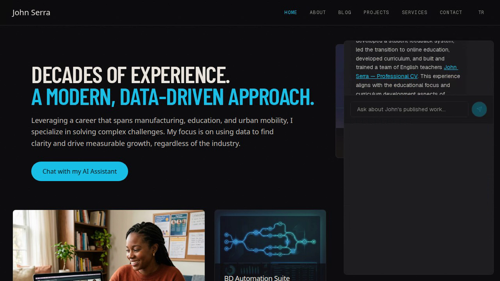
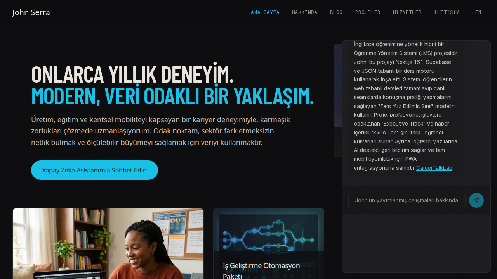

# Production evidence — 2026-09-13–14 UTC

Runtime commit: `fd35295159579b8845b7ed15a0e656db43b795f1`. Production: [johnserra.com](https://johnserra.com). Deployment identity, check time, and prior rollback target are in [deployment.json](deployment.json). The application was staged with production configuration, passed CI and homepage readiness, then promoted. No database migration, reindex, or CMS write was performed.

## Six-case API replay: 3/6 passed

[Exact results](api-results.json) and [sanitized runtime events](api-runtime-traces.json) cover six sequential requests on 2026-09-13, with 10-second minimum start spacing, 55-second request timeout, random session UUIDs, and no retries. The fixed prompts, history policy and grading are in [api-replay.cjs](api-replay.cjs). Running this script makes up to six paid live requests; copy it into a fresh output directory first because it writes `results.json` there. It needs a Node runtime with native fetch.

| Case | Result | Main observation |
| --- | --- | --- |
| Greeting | Pass | Helpful response, no retrieval |
| Professional strengths/CV | Pass | Two accepted tools and one verifier; two distinct cited URLs |
| Ambiguous follow-up | Fail | Generic insufficient-evidence response |
| Turkish-language professional question | Fail | Generic English response; actual request locale was `en` |
| Unsupported Nobel premise | Fail | Safe but generic qualification |
| Multi-source AI product fit | Pass | Two accepted tools and one verifier; three distinct cited URLs |

All three distinct citation targets checked by this replay returned HTTP 200. The original deployment passed 0/6; see [before evidence](../2026-09-13-before/README.md). Later request histories differ because the harness includes earlier passing answers, so the result is not a controlled identical-payload comparison. Scores test response usefulness/citation presence and accessibility, not independently proven truth. The API output's obsolete scratch media pointer has been normalized; answers and request metrics are unchanged.

[The multi-tool trace](multi-tool-trace.md) gives the exact public prompt/answer and corresponding independent server events. Neither tool use nor verification is inferred from answer prose.

## Additional live checks and recording attempts

[Predeployment results](predeployment-live-results.json), collected against real dependencies on the same source tree, preserve a combined CV/project Turkish failure (`verifier_failure`, one tool/one verifier) and an English comparison success (two tools/one verifier). These are separate from the production API scores.

[The first recording attempt](failed-recorder-attempt.json) sent no chat requests: an incorrect English button selector timed out, and the Turkish selector matched two buttons. It is an automation failure, not an assistant benchmark. Its screenshots/video are not presented as cited response evidence.

The next attempt corrected the selector and visibly produced a greeting, an uncited English broad-role fallback, and a cited Turkish project answer. Recording finalization was interrupted, so it lacks a complete client transcript and playable final video; it is not counted as a completed demo or a three-case evaluation. A fresh final walkthrough uses an explicit named project/CV comparison, while retaining these failures as limitations.

## Completed selected walkthrough — 2026-09-14 UTC

[Watch/download the unedited two-minute video](../../../public/digital-twin/demo-2026-09-14.webm). Encoded duration: **119.64 seconds**; recording wall time: **120.006 seconds**. [Exact client results](recording.json), [independent server events](demo-runtime-traces.json), and [media hashes](media-integrity.json) are retained.

All three selected scenarios completed: a no-tool greeting; the explicit CareerTalkLab/project-CV comparison (two tools, one verifier, `supported_evidence`); and a Turkish CareerTalkLab explanation with actual `locale=tr` (one tool, one verifier, `supported_evidence`). All emitted citation targets returned HTTP 200. Requested brevity is not included in this pass rubric; the Turkish answer exceeds its requested 80-word limit.

The final walkthrough used different factual prompts from the six-case replay and is not added to that score. The English comparison names its two sources explicitly; it does not demonstrate that the earlier broad role-fit prompt was fixed.

Presentation limitation: the recorder scrolled the long English answer out of the visible panel. The English image is an unmodified frame extracted at 24.3 seconds, where its CV citation is visible; the complete answer is in the client results. The Turkish image is the original screenshot. The video preserves this scrolling behavior and its pauses; no generated answer or time segment was synthesized.

## Scope and privacy

These are public synthetic questions about published work. Published server events omit prompts, answers, raw IP/session identities, secrets, and provider diagnostics. Correlation IDs connect the synthetic client to logs. The browser screenshots contain only the public site and synthetic conversation. Runtime logging is not a durable transcript store.

The verifier's supported-claim counts are model judgments. Cost fields have different purposes: the agent trace uses a conservative budget estimate, while completion events use model pricing estimates. They are not invoices and do not establish complete embedding/retrieval costs. Small samples and selected demo questions do not establish general reliability.
