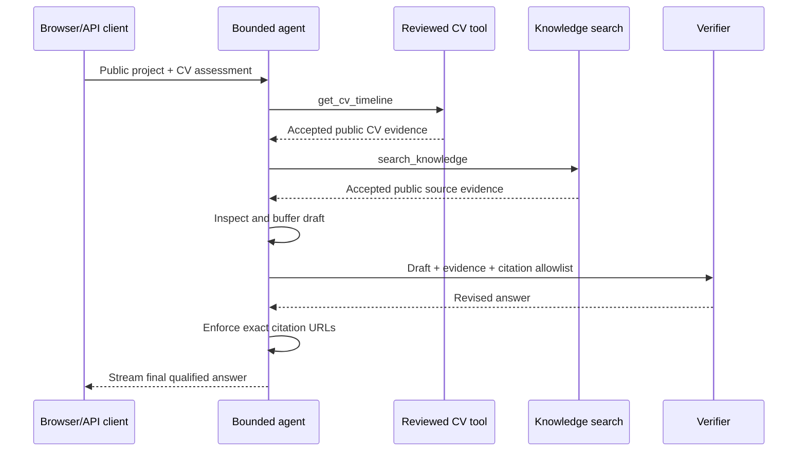

# Production multi-tool answer — 2026-09-13 UTC

Deployment `dpl_DLTw265AKUjT2ESHPBHHzhDVS36a`, runtime commit `fd35295159579b8845b7ed15a0e656db43b795f1`.

Correlation ID: `0430e3f2-8813-462b-8e62-3ebaf392365d`. Client request started at `2026-09-13T22:37:33.672Z`; HTTP 200/done, elapsed 8474 ms. This public synthetic request and its exact answer are retained in [API results](api-results.json). The [sanitized server events](api-runtime-traces.json) were fetched independently by correlation ID.

The server recorded two distinct successful read-only tools: `get_cv_timeline` (2 ms, 8,970 output bytes) and `search_knowledge` (777 ms, 4,737 bytes). The agent recorded one retrieval round and one verifier pass, six state steps, a revision, and `qualified_completion`. The final completion event counted six citation occurrences; the client found three distinct destinations, all HTTP 200. Model-rated supported claims: 13; this count is not semantic proof.

The diagram presents logical dependencies; it does not claim serial wall-clock execution of parallel tool calls.

## Exact user prompt

Combine the published project evidence on this site with the reviewed CV evidence to assess whether John Serra is a strong fit for an AI product role. Use multiple public sources or tools if available, cite every claim, and clearly qualify anything that cannot be verified.

## Exact returned answer

Based on the published project evidence and reviewed CV, John Serra demonstrates several strengths that align with an AI product role, particularly in areas requiring strategic implementation, process automation, and user-centric development.

John's experience includes developing software and automation tools, as highlighted by his "Business development automation" project. This project involved creating a modular suite for prospect research, lead qualification, follow-up scheduling, and outreach drafting with human review, indicating hands-on experience with AI-assisted applications and workflow automation [John Serra — Professional CV](https://johnserra.com/cv/john-serra.en.md). This directly relates to an AI product role's need for practical application of AI to solve business problems.

His "CareerTalkLab" project further showcases his capabilities in building a learning platform with various interactive features. This includes a custom lesson engine, AI Feedback Engine (Claude-powered drafting system with level-aware prompting and native-language translation), and an automated testing suite [CareerTalkLab](https://johnserra.com/projects/careertalklab). This project demonstrates his ability to develop complex systems, integrate AI for user feedback, and focus on the student experience, which are valuable skills for product development, especially in AI-driven educational or analytical tools. The project is described as a long-term personal effort to share knowledge and help others learn, with a data analytics curriculum planned, suggesting an interest in data-driven solutions [John Serra — Professional CV](https://johnserra.com/cv/john-serra.en.md).

Furthermore, John's professional summary mentions combining client relationship management, team leadership, and process improvement with hands-on development of software and automation tools [John Serra — Professional CV](https://johnserra.com/cv/john-serra.en.md). His work in urban mobility involves driving market growth and operational excellence at the intersection of technical strategy and human-centric execution, with a focus on building systems and relationships to scale markets [About John Serra](https://johnserra.com/about). He also describes architecting growth through an automated business development engine to transform market research and lead generation into a data-driven precision tool [About John Serra](https://johnserra.com/about). These experiences suggest a strategic mindset for leveraging technology, including AI, to achieve business objectives and improve user experiences.

## Logging boundary

The application logs counts and correlation IDs, not prompts or answers. The public answer above was captured by the synthetic client and joined to sanitized logs afterward. The trace's conservative budget-cost field differs from the completion event's pricing estimate; neither is an invoice or a complete retrieval-cost accounting.
